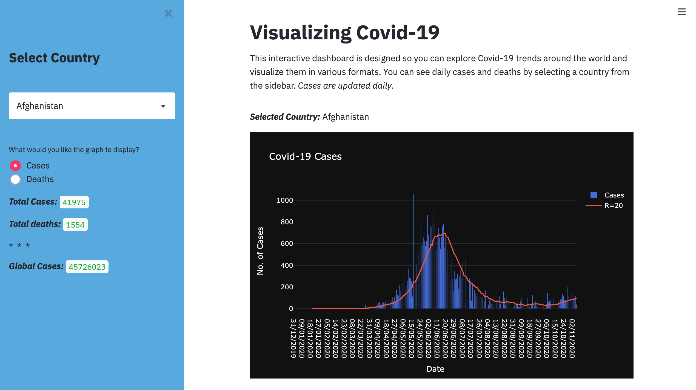

# Covid19-Streamlit

This python project implements streamlit API and plotly to create a COVID-19 dashboard interface. you can select any country to visualize the numner of cases/deaths and the rolling mean which are updated daily from the source: https://opendata.ecdc.europa.eu/covid19/casedistribution/csv.

